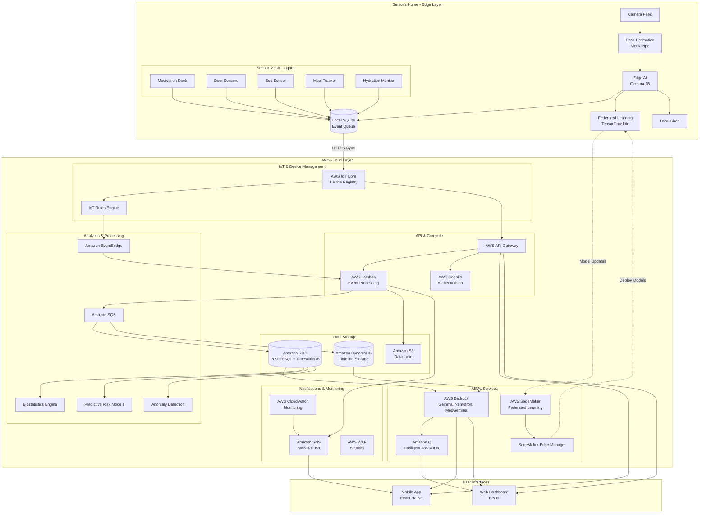

# Design Document: AETHER

## Overview

AETHER (Autonomous Elderly Ecosystem for Total Health Emergency Response & Optimization) is a distributed healthcare monitoring system that combines edge computing, IoT sensor fusion, and AI-powered reasoning to provide safety monitoring for elderly individuals while preserving privacy.

The system architecture follows a privacy-first, offline-first design philosophy where sensitive processing occurs at the edge, only event metadata is transmitted to the cloud, and critical safety functions operate independently of network connectivity.

### Key Design Principles

1. **Privacy by Design**: Video processing occurs entirely on edge devices; only pose estimation metadata leaves the device
2. **Offline-First**: Critical safety functions (fall detection, local alerts) operate without internet connectivity
3. **Progressive Enhancement**: System provides basic safety with minimal sensors, enhanced insights with full sensor mesh
4. **Fail-Safe Defaults**: System failures trigger alerts rather than silent failures
5. **Separation of Concerns**: Edge processing, cloud aggregation, and AI reasoning are loosely coupled
6. **Event-Driven Architecture**: Components communicate through timestamped events rather than continuous data streams

### Technology Stack

**Edge Layer:**
- Hardware: Raspberry Pi 4 or NVIDIA Jetson Nano for pose estimation
- Pose Estimation: MediaPipe Pose or OpenPose running locally
- Local Storage: SQLite for event queuing
- Communication: MQTT for sensor mesh, HTTPS for cloud sync
- Federated Learning: TensorFlow Lite or PyTorch Mobile for on-device training

**Sensor Mesh:**
- Protocol: Zigbee or Thread for low-power mesh networking
- Sensors: ESP32-based devices with weight sensors, magnetic switches, pressure mats
- Power: CR2032 batteries with 12-18 month life expectancy
- Management: AWS IoT Core for device registration and fleet management

**Cloud Layer (AWS Services):**
- API Gateway: AWS API Gateway with Lambda integration
- Compute: AWS Lambda for serverless event processing
- Database: Amazon RDS PostgreSQL with TimescaleDB extension for time-series
- NoSQL: Amazon DynamoDB for timeline storage with on-demand capacity
- Message Queue: Amazon SQS and Amazon EventBridge for event processing
- Storage: Amazon S3 for data storage with lifecycle policies
- IoT: AWS IoT Core for device management and communication
- Encryption: AWS KMS for key management and encryption
- Authentication: AWS Cognito for user authentication and authorization
- Monitoring: AWS CloudWatch for logs, metrics, and alarms
- Security: AWS WAF for web application firewall

**AI/ML Layer (AWS Bedrock & SageMaker):**
- Gemma 2B: On-device summarization via AWS Bedrock (runs on edge device)
- Nemotron 70B: Complex reasoning and pattern analysis via AWS Bedrock (cloud-based)
- MedGemma: Medical triage advisory via AWS Bedrock (cloud-based, post-MVP)
- Federated Learning: AWS SageMaker for orchestration and model aggregation
- Model Deployment: SageMaker Edge Manager for edge model deployment
- Model Monitoring: SageMaker Model Monitor for performance tracking
- Inference: ONNX Runtime for edge, AWS Bedrock for cloud inference
- Intelligent Assistance: Amazon Q for query capabilities and insights

**Analytics & ML:**
- Biostatistics: Python with SciPy, statsmodels, and pandas
- Time-Series Analysis: Prophet, ARIMA, or LSTM models
- Anomaly Detection: Isolation Forest, Autoencoders
- Graph Neural Networks: PyTorch Geometric for medication interaction modeling
- Explainable AI: SHAP, LIME for model interpretability

**Mobile/Web:**
- Mobile: React Native for iOS/Android
- Web Dashboard: React with TypeScript
- Real-time Updates: WebSocket connections via AWS API Gateway
- Notifications: Amazon SNS for push notifications and SMS
- Analytics: Amazon Pinpoint for user engagement tracking

## Architecture

### System Architecture Diagram



### Component Interaction Flow

**Normal Operation Flow:**
1. Sensors detect events (medication taken, door opened, movement detected)
2. Events are timestamped and stored in local SQLite queue
3. Edge device syncs events to cloud every 60 seconds (when online)
4. Cloud event processor validates and stores events in timeline database
5. GenAI reasoning layer analyzes events every 24 hours
6. Insights are pushed to mobile app and web dashboard

**Emergency Flow (Fall Detection):**
1. Camera captures frames at 15 FPS
2. Pose estimation detects fall pattern (confidence > 0.85)
3. Local siren activates immediately (< 3 seconds)
4. Edge AI creates fall event with metadata
5. If not cancelled within 30 seconds, SMS sent to primary caregiver
6. If no acknowledgment within 5 minutes, escalate to secondary contacts
7. Event logged to local database and synced when connectivity available

**Offline Operation Flow:**
1. Edge device detects loss of internet connectivity
2. System continues fall detection and local alerting
3. Events queue in local SQLite database
4. SMS fallback used for emergency alerts (if cellular available)
5. When connectivity restored, queued events sync to cloud
6. Cloud processes backlog and updates timelines

## Components and Interfaces

### Edge Device Component

**Responsibilities:**
- Run pose estimation on camera feed
- Detect fall patterns in real-time
- Coordinate sensor mesh communication
- Queue events locally
- Trigger local alarms
- Sync data to cloud when online

**Interfaces:**

```typescript
interface EdgeDevice {
  // Pose estimation
  processCameraFrame(frame: ImageData): PoseEstimationResult;
  detectFall(pose: PoseEstimationResult): FallDetection;
  
  // Event management
  queueEvent(event: SensorEvent): void;
  syncEvents(): Promise<SyncResult>;
  
  // Alert management
  triggerLocalAlarm(event: EmergencyEvent): void;
  cancelAlarm(userId: string): boolean;
  
  // Sensor mesh
  registerSensor(sensor: SensorDevice): void;
  receiveSensorData(sensorId: string, data: SensorReading): void;
  
  // System health
  performDiagnostics(): DiagnosticReport;
  getSystemStatus(): SystemStatus;
}

interface PoseEstimationResult {
  keypoints: Keypoint[];
  confidence: number;
  timestamp: number;
  boundingBox: BoundingBox;
}

interface FallDetection {
  isFall: boolean;
  confidence: number;
  timestamp: number;
  poseSnapshot: PoseEstimationResult;
  velocityMetrics: VelocityData;
}

interface SensorEvent {
  eventId: string;
  sensorId: string;
  eventType: EventType;
  timestamp: number;
  metadata: Record<string, any>;
  privacyLevel: PrivacyLevel;
}
```

### Sensor Mesh Component

**Responsibilities:**
- Maintain low-power mesh network
- Report sensor readings to edge device
- Monitor battery levels
- Auto-discover new sensors

**Interfaces:**

```typescript
interface SensorDevice {
  sensorId: string;
  sensorType: SensorType;
  batteryLevel: number;
  lastSeen: number;
  
  // Sensor operations
  takeMeasurement(): SensorReading;
  calibrate(): CalibrationResult;
  enterSleepMode(): void;
  wakeUp(): void;
  
  // Communication
  sendReading(reading: SensorReading): void;
  acknowledgeMesh(): void;
}

interface MedicationDock extends SensorDevice {
  compartments: MedicationCompartment[];
  detectCompartmentOpen(compartmentId: string): boolean;
  getSchedule(): MedicationSchedule;
}

interface DoorSensor extends SensorDevice {
  isOpen: boolean;
  openCount: number;
  lastStateChange: number;
}

interface BedSensor extends SensorDevice {
  pressureReading: number;
  isOccupied: boolean;
  occupancyDuration: number;
}
```

### Timeline Aggregator Component

**Responsibilities:**
- Receive events from edge devices
- Validate and deduplicate events
- Store events in time-series database
- Provide query interface for event retrieval
- Generate event summaries

**Interfaces:**

```typescript
interface TimelineAggregator {
  // Event ingestion
  ingestEvent(event: SensorEvent): Promise<void>;
  ingestBatch(events: SensorEvent[]): Promise<BatchResult>;
  
  // Event retrieval
  getTimeline(userId: string, startTime: number, endTime: number): Promise<Timeline>;
  getEventsByType(userId: string, eventType: EventType, limit: number): Promise<SensorEvent[]>;
  
  // Aggregation
  generateDailySummary(userId: string, date: Date): Promise<DailySummary>;
  getPatternAnalysis(userId: string, days: number): Promise<PatternAnalysis>;
  
  // Export
  exportTimeline(userId: string, format: ExportFormat): Promise<ExportData>;
}

interface Timeline {
  userId: string;
  events: SensorEvent[];
  startTime: number;
  endTime: number;
  eventCount: number;
  groupedEvents: EventGroup[];
}

interface EventGroup {
  groupId: string;
  eventType: EventType;
  events: SensorEvent[];
  startTime: number;
  endTime: number;
  summary: string;
}

interface DailySummary {
  date: Date;
  userId: string;
  medicationAdherence: number;
  mealCount: number;
  hydrationEvents: number;
  sleepDuration: number;
  activityLevel: ActivityLevel;
  alerts: AlertSummary[];
  aiInsights: string;
}
```

### Emergency Escalation Component

**Responsibilities:**
- Manage escalation state machine
- Route alerts to appropriate contacts
- Track acknowledgments and timeouts
- Implement retry logic
- Log all escalation events

**Interfaces:**

```typescript
interface EmergencyEscalator {
  // Escalation management
  initiateEscalation(event: EmergencyEvent): EscalationSession;
  cancelEscalation(sessionId: string, userId: string): boolean;
  acknowledgeAlert(sessionId: string, contactId: string): void;
  
  // Contact management
  getEscalationLadder(userId: string): EscalationContact[];
  updateEscalationLadder(userId: string, contacts: EscalationContact[]): void;
  
  // Notification
  sendAlert(contact: EscalationContact, event: EmergencyEvent): Promise<NotificationResult>;
  
  // State tracking
  getEscalationStatus(sessionId: string): EscalationStatus;
  getActiveEscalations(userId: string): EscalationSession[];
}

interface EscalationSession {
  sessionId: string;
  userId: string;
  event: EmergencyEvent;
  startTime: number;
  currentLevel: number;
  status: EscalationStatus;
  notifications: NotificationLog[];
  acknowledgedBy?: string;
  cancelledBy?: string;
}

interface EscalationContact {
  contactId: string;
  name: string;
  priority: number;
  contactMethods: ContactMethod[];
  availabilitySchedule?: Schedule;
  timeoutSeconds: number;
}

interface EmergencyEvent {
  eventId: string;
  eventType: 'fall' | 'medical' | 'panic' | 'system_failure';
  severity: 'low' | 'medium' | 'high' | 'critical';
  timestamp: number;
  location?: string;
  metadata: Record<string, any>;
  requiresAcknowledgment: boolean;
}
```

### GenAI Reasoning Layer Component

**Responsibilities:**
- Route tasks to appropriate AI models
- Generate daily health summaries
- Identify patterns and anomalies
- Produce evidence-based insights
- Ensure outputs include disclaimers

**Interfaces:**

```typescript
interface GenAIReasoningLayer {
  // Model routing
  routeTask(task: AITask): Promise<AIModel>;
  
  // Summary generation
  generateDailySummary(timeline: Timeline): Promise<AISummary>;
  generateWeeklySummary(timelines: Timeline[]): Promise<AISummary>;
  
  // Pattern analysis
  analyzePatterns(userId: string, days: number): Promise<PatternInsights>;
  detectAnomalies(timeline: Timeline, baseline: Baseline): Promise<Anomaly[]>;
  
  // Triage advisory (post-MVP)
  generateTriageAdvisory(event: EmergencyEvent, context: HealthContext): Promise<TriageAdvisory>;
}

interface AITask {
  taskId: string;
  taskType: 'summarization' | 'reasoning' | 'triage' | 'pattern_detection';
  inputData: any;
  priority: number;
  maxLatencyMs: number;
}

interface AIModel {
  modelName: string;
  modelType: 'gemma' | 'nemotron' | 'medgemma';
  location: 'edge' | 'cloud';
  maxTokens: number;
  estimatedLatencyMs: number;
}

interface AISummary {
  summaryId: string;
  userId: string;
  period: DateRange;
  generatedAt: number;
  modelUsed: string;
  summary: string;
  keyInsights: Insight[];
  concerns: Concern[];
  disclaimer: string;
  confidence: number;
}

interface Insight {
  insightId: string;
  category: string;
  description: string;
  supportingEvents: string[];
  confidence: number;
  actionable: boolean;
}

interface Concern {
  concernId: string;
  severity: 'low' | 'medium' | 'high';
  description: string;
  evidence: string[];
  recommendation: string;
  requiresFollowup: boolean;
}

interface PatternInsights {
  userId: string;
  analysisWindow: DateRange;
  patterns: DetectedPattern[];
  deviations: Deviation[];
  trends: Trend[];
}

interface DetectedPattern {
  patternType: string;
  description: string;
  frequency: number;
  confidence: number;
  firstObserved: number;
  lastObserved: number;
}
```

### Model Router Component

**Responsibilities:**
- Select appropriate AI model for each task
- Balance latency, accuracy, and cost
- Handle model fallbacks
- Track model performance

**Interfaces:**

```typescript
interface ModelRouter {
  // Routing decisions
  selectModel(task: AITask, constraints: ModelConstraints): AIModel;
  
  // Model management
  getAvailableModels(location: 'edge' | 'cloud'): AIModel[];
  isModelAvailable(modelName: string): boolean;
  
  // Performance tracking
  recordModelPerformance(modelName: string, metrics: PerformanceMetrics): void;
  getModelStats(modelName: string): ModelStatistics;
}

interface ModelConstraints {
  maxLatencyMs: number;
  requiresOffline: boolean;
  minConfidence: number;
  maxCostPerInference?: number;
}

interface PerformanceMetrics {
  latencyMs: number;
  tokensGenerated: number;
  confidence: number;
  success: boolean;
  timestamp: number;
}

interface ModelStatistics {
  modelName: string;
  totalInferences: number;
  averageLatencyMs: number;
  successRate: number;
  averageConfidence: number;
  lastUsed: number;
}
```

### Federated Learning Component

**Responsibilities:**
- Orchestrate federated learning across multiple edge devices
- Aggregate model updates while preserving privacy
- Apply differential privacy to model updates
- Deploy updated models to edge devices
- Monitor federated learning performance

**Interfaces:**

```typescript
interface FederatedLearningOrchestrator {
  // Training orchestration
  initiateTrainingRound(modelId: string, participants: string[]): TrainingRound;
  collectModelUpdates(roundId: string): ModelUpdate[];
  aggregateUpdates(updates: ModelUpdate[]): AggregatedModel;
  
  // Privacy preservation
  applyDifferentialPrivacy(update: ModelUpdate, epsilon: number): PrivateModelUpdate;
  validatePrivacyBudget(userId: string): PrivacyBudget;
  
  // Model deployment
  deployModel(model: AggregatedModel, targets: string[]): DeploymentResult;
  
  // Monitoring
  getTrainingMetrics(roundId: string): TrainingMetrics;
  compareModelPerformance(modelA: string, modelB: string): PerformanceComparison;
}

interface TrainingRound {
  roundId: string;
  modelId: string;
  participants: string[];
  startTime: number;
  endTime?: number;
  status: 'initiated' | 'collecting' | 'aggregating' | 'deploying' | 'completed' | 'failed';
  participantCount: number;
  updatesReceived: number;
}

interface ModelUpdate {
  updateId: string;
  userId: string;
  modelId: string;
  roundId: string;
  gradients: number[][];
  sampleCount: number;
  trainingLoss: number;
  validationAccuracy: number;
  timestamp: number;
}

interface PrivateModelUpdate extends ModelUpdate {
  epsilon: number;
  delta: number;
  noiseScale: number;
  privacyBudgetUsed: number;
}

interface AggregatedModel {
  modelId: string;
  roundId: string;
  weights: number[][];
  participantCount: number;
  aggregationMethod: 'fedavg' | 'fedprox' | 'fedadam';
  globalAccuracy: number;
  timestamp: number;
}

interface PrivacyBudget {
  userId: string;
  totalBudget: number;
  usedBudget: number;
  remainingBudget: number;
  resetDate: Date;
}
```

### Biostatistics Component

**Responsibilities:**
- Aggregate anonymized health metrics across installations
- Calculate population-level statistics
- Perform statistical significance testing
- Generate population health reports
- Ensure data anonymization

**Interfaces:**

```typescript
interface BiostatisticsEngine {
  // Population aggregation
  aggregatePopulationMetrics(metric: MetricType, timeRange: DateRange): PopulationMetrics;
  
  // Statistical analysis
  calculateDescriptiveStats(data: number[]): DescriptiveStatistics;
  performSignificanceTest(groupA: number[], groupB: number[]): SignificanceTest;
  calculateConfidenceInterval(data: number[], confidence: number): ConfidenceInterval;
  
  // Trend analysis
  detectTrends(timeSeries: TimeSeriesData): TrendAnalysis;
  forecastMetric(timeSeries: TimeSeriesData, horizon: number): Forecast;
  
  // Anonymization
  anonymizeData(data: HealthData[]): AnonymizedData[];
  validateAnonymization(data: AnonymizedData[]): AnonymizationReport;
}

interface PopulationMetrics {
  metric: MetricType;
  timeRange: DateRange;
  sampleSize: number;
  mean: number;
  median: number;
  standardDeviation: number;
  percentiles: Record<number, number>;
  distribution: DistributionData;
}

interface DescriptiveStatistics {
  count: number;
  mean: number;
  median: number;
  mode: number;
  standardDeviation: number;
  variance: number;
  min: number;
  max: number;
  quartiles: [number, number, number];
  skewness: number;
  kurtosis: number;
}

interface SignificanceTest {
  testType: 't-test' | 'mann-whitney' | 'chi-square' | 'anova';
  statistic: number;
  pValue: number;
  significant: boolean;
  confidenceLevel: number;
  effectSize: number;
}

interface TrendAnalysis {
  trendDirection: 'increasing' | 'decreasing' | 'stable' | 'cyclical';
  slope: number;
  rSquared: number;
  pValue: number;
  seasonality: SeasonalityInfo;
  changePoints: ChangePoint[];
}
```

### Predictive Risk Modeling Component

**Responsibilities:**
- Predict fall risk based on activity patterns
- Predict medication non-adherence risk
- Generate proactive alerts for high-risk patients
- Provide explainable risk scores
- Update predictions daily

**Interfaces:**

```typescript
interface PredictiveRiskModeler {
  // Risk prediction
  predictFallRisk(userId: string, features: HealthFeatures): RiskPrediction;
  predictAdherenceRisk(userId: string, features: HealthFeatures): RiskPrediction;
  predictHealthDecline(userId: string, features: HealthFeatures): RiskPrediction;
  
  // Explanation
  explainPrediction(prediction: RiskPrediction): Explanation;
  getFeatureImportance(modelId: string): FeatureImportance[];
  
  // Monitoring
  updateRiskScores(userId: string): void;
  getRiskTrends(userId: string, days: number): RiskTrend[];
}

interface RiskPrediction {
  predictionId: string;
  userId: string;
  riskType: 'fall' | 'non-adherence' | 'health-decline';
  riskScore: number;  // 0.0 to 1.0
  riskLevel: 'low' | 'medium' | 'high' | 'critical';
  confidence: number;
  predictedAt: number;
  validUntil: number;
  contributingFactors: Factor[];
}

interface Explanation {
  predictionId: string;
  topFactors: Factor[];
  counterfactuals: Counterfactual[];
  similarCases: SimilarCase[];
  visualizations: ExplanationVisualization[];
}

interface Factor {
  featureName: string;
  featureValue: any;
  importance: number;
  direction: 'increases' | 'decreases';
  description: string;
}

interface Counterfactual {
  description: string;
  requiredChanges: Record<string, any>;
  newRiskScore: number;
  feasibility: number;
}
```

### Anomaly Detection Component

**Responsibilities:**
- Detect anomalies in daily activity patterns
- Distinguish benign from concerning anomalies
- Provide context for detected anomalies
- Adapt thresholds to reduce false positives
- Generate anomaly alerts

**Interfaces:**

```typescript
interface AnomalyDetector {
  // Anomaly detection
  detectAnomalies(userId: string, timeRange: DateRange): Anomaly[];
  classifyAnomaly(anomaly: Anomaly, context: UserContext): AnomalyClassification;
  
  // Threshold adaptation
  updateThresholds(userId: string, feedback: AnomalyFeedback[]): void;
  getAdaptiveThresholds(userId: string): AdaptiveThresholds;
  
  // Context analysis
  analyzeAnomalyContext(anomaly: Anomaly): AnomalyContext;
  compareToBaseline(current: HealthMetrics, baseline: HealthBaseline): Deviation[];
}

interface Anomaly {
  anomalyId: string;
  userId: string;
  detectedAt: number;
  anomalyType: 'activity' | 'sleep' | 'medication' | 'nutrition' | 'multi-factor';
  severity: number;  // 0.0 to 1.0
  description: string;
  affectedMetrics: string[];
  duration: number;
}

interface AnomalyClassification {
  anomalyId: string;
  classification: 'benign' | 'concerning' | 'urgent';
  confidence: number;
  reasoning: string;
  recommendedAction: string;
  shouldAlert: boolean;
}

interface AnomalyContext {
  anomalyId: string;
  temporalContext: TemporalContext;
  behavioralContext: BehavioralContext;
  environmentalContext: EnvironmentalContext;
  historicalComparison: HistoricalComparison;
}
```

### Medication Interaction Component

**Responsibilities:**
- Maintain knowledge graph of medication interactions
- Check for drug interactions
- Alert care professionals about potential interactions
- Track temporal patterns of medication taking
- Provide evidence-based interaction warnings

**Interfaces:**

```typescript
interface MedicationInteractionChecker {
  // Interaction checking
  checkInteractions(medications: Medication[]): Interaction[];
  checkTemporalInteractions(schedule: MedicationSchedule): TemporalInteraction[];
  
  // Knowledge graph
  queryKnowledgeGraph(query: InteractionQuery): InteractionResult[];
  updateKnowledgeGraph(source: MedicalKnowledgeSource): void;
  
  // Alerting
  generateInteractionAlert(interaction: Interaction): InteractionAlert;
  prioritizeInteractions(interactions: Interaction[]): PrioritizedInteraction[];
}

interface Interaction {
  interactionId: string;
  medications: string[];
  interactionType: 'major' | 'moderate' | 'minor';
  severity: number;
  description: string;
  mechanism: string;
  clinicalEffects: string[];
  management: string;
  evidence: Evidence[];
}

interface TemporalInteraction {
  interactionId: string;
  medications: string[];
  timingIssue: string;
  recommendedSeparation: number;  // minutes
  currentSeparation: number;
  risk: 'high' | 'medium' | 'low';
}

interface InteractionAlert {
  alertId: string;
  userId: string;
  interaction: Interaction;
  urgency: 'immediate' | 'soon' | 'routine';
  recipients: string[];
  actionRequired: string;
  evidence: Evidence[];
}

interface Evidence {
  source: string;
  publicationDate: Date;
  evidenceLevel: 'high' | 'moderate' | 'low';
  summary: string;
  url?: string;
}
```

## Data Models

### Core Event Model

```typescript
enum EventType {
  FALL_DETECTED = 'fall_detected',
  MEDICATION_TAKEN = 'medication_taken',
  MEDICATION_MISSED = 'medication_missed',
  MEAL_DETECTED = 'meal_detected',
  HYDRATION_DETECTED = 'hydration_detected',
  SLEEP_START = 'sleep_start',
  SLEEP_END = 'sleep_end',
  DOOR_OPENED = 'door_opened',
  DOOR_CLOSED = 'door_closed',
  ACTIVITY_DETECTED = 'activity_detected',
  ALERT_TRIGGERED = 'alert_triggered',
  ALERT_ACKNOWLEDGED = 'alert_acknowledged',
  ALERT_CANCELLED = 'alert_cancelled',
  SYSTEM_ONLINE = 'system_online',
  SYSTEM_OFFLINE = 'system_offline',
  BATTERY_LOW = 'battery_low'
}

enum PrivacyLevel {
  MINIMAL = 'minimal',      // Event type and timestamp only
  STANDARD = 'standard',    // Event type, timestamp, basic metadata
  ENHANCED = 'enhanced'     // Full event details and context
}

interface SensorEvent {
  eventId: string;           // UUID
  userId: string;            // User being monitored
  sensorId: string;          // Source sensor
  eventType: EventType;
  timestamp: number;         // Unix timestamp in milliseconds
  privacyLevel: PrivacyLevel;
  metadata: EventMetadata;
  synced: boolean;           // Has event been synced to cloud?
  syncedAt?: number;
}

interface EventMetadata {
  confidence?: number;       // For AI-detected events
  duration?: number;         // For duration-based events
  value?: number;            // For measurement events
  location?: string;         // Room or area identifier
  batteryLevel?: number;     // For sensor health
  [key: string]: any;        // Extensible for event-specific data
}
```

### User and Contact Models

```typescript
interface User {
  userId: string;
  profile: UserProfile;
  settings: UserSettings;
  devices: RegisteredDevice[];
  contacts: EscalationContact[];
  baseline: HealthBaseline;
  createdAt: number;
  lastActive: number;
}

interface UserProfile {
  firstName: string;
  lastName: string;
  dateOfBirth: Date;
  timezone: string;
  address?: Address;
  emergencyInfo?: EmergencyInfo;
}

interface UserSettings {
  privacyLevel: PrivacyLevel;
  alertPreferences: AlertPreferences;
  medicationSchedule: MedicationSchedule;
  quietHours?: TimeRange;
  learningMode: boolean;
  learningModeEndDate?: Date;
}

interface AlertPreferences {
  enableLocalSiren: boolean;
  sirenVolume: number;
  alertCancellationWindow: number;  // seconds
  fallDetectionSensitivity: number; // 0.0 to 1.0
  enableVoiceInteraction: boolean;
}

interface MedicationSchedule {
  medications: Medication[];
  reminderEnabled: boolean;
  reminderAdvanceMinutes: number;
  escalationDelayHours: number;
}

interface Medication {
  medicationId: string;
  name: string;
  dosage: string;
  compartmentId: string;
  schedule: DailySchedule[];
  instructions?: string;
}

interface DailySchedule {
  dayOfWeek?: number;  // 0-6, undefined means every day
  timeOfDay: string;   // HH:MM format
  required: boolean;
}
```

### Health Baseline and Analytics Models

```typescript
interface HealthBaseline {
  userId: string;
  establishedAt: number;
  validFrom: number;
  validUntil: number;
  
  // Activity patterns
  typicalWakeTime: TimeRange;
  typicalSleepTime: TimeRange;
  averageSleepDuration: number;
  typicalBathroomVisits: number;
  
  // Medication adherence
  baselineAdherence: number;  // percentage
  
  // Nutrition and hydration
  averageMealsPerDay: number;
  averageHydrationEvents: number;
  
  // Activity level
  averageDoorOpenings: number;
  activityPattern: ActivityPattern;
}

interface ActivityPattern {
  hourlyActivity: number[];  // 24 values, activity level per hour
  weeklyPattern: number[];   // 7 values, activity level per day of week
  variability: number;       // Standard deviation
}

interface HealthMetrics {
  userId: string;
  date: Date;
  
  // Sleep metrics
  sleepDuration: number;
  sleepInterruptions: number;
  timeToSleep: number;
  
  // Medication metrics
  medicationsTaken: number;
  medicationsMissed: number;
  adherenceRate: number;
  
  // Nutrition metrics
  mealCount: number;
  hydrationCount: number;
  
  // Activity metrics
  doorOpenings: number;
  bathroomVisits: number;
  activityScore: number;
  
  // Alerts
  fallEvents: number;
  alertsTriggered: number;
  falseAlarms: number;
}
```

### Escalation and Alert Models

```typescript
interface EscalationContact {
  contactId: string;
  userId: string;           // User being monitored
  name: string;
  relationship: string;
  priority: number;         // 1 = primary, 2 = secondary, etc.
  
  contactMethods: ContactMethod[];
  availabilitySchedule?: Schedule;
  timeoutSeconds: number;
  
  notificationPreferences: NotificationPreferences;
  active: boolean;
}

interface ContactMethod {
  methodType: 'sms' | 'phone' | 'app' | 'email';
  value: string;
  verified: boolean;
  primary: boolean;
}

interface Schedule {
  timezone: string;
  availableHours: TimeRange[];
  unavailableDates: Date[];
}

interface TimeRange {
  start: string;  // HH:MM format
  end: string;    // HH:MM format
}

interface NotificationPreferences {
  enablePushNotifications: boolean;
  enableSMS: boolean;
  enableEmail: boolean;
  quietHours?: TimeRange;
  alertTypes: EventType[];  // Which event types to receive
}

interface EscalationSession {
  sessionId: string;
  userId: string;
  event: EmergencyEvent;
  
  startTime: number;
  endTime?: number;
  currentLevel: number;
  status: EscalationStatus;
  
  notifications: NotificationLog[];
  acknowledgedBy?: string;
  acknowledgedAt?: number;
  cancelledBy?: string;
  cancelledAt?: number;
  
  escalationHistory: EscalationStep[];
}

enum EscalationStatus {
  INITIATED = 'initiated',
  WAITING_ACKNOWLEDGMENT = 'waiting_acknowledgment',
  ACKNOWLEDGED = 'acknowledged',
  CANCELLED = 'cancelled',
  ESCALATED = 'escalated',
  COMPLETED = 'completed',
  FAILED = 'failed'
}

interface EscalationStep {
  level: number;
  contactId: string;
  attemptedAt: number;
  method: string;
  success: boolean;
  acknowledgedAt?: number;
}

interface NotificationLog {
  notificationId: string;
  contactId: string;
  method: string;
  sentAt: number;
  deliveredAt?: number;
  readAt?: number;
  acknowledgedAt?: number;
  status: NotificationStatus;
  errorMessage?: string;
}

enum NotificationStatus {
  PENDING = 'pending',
  SENT = 'sent',
  DELIVERED = 'delivered',
  READ = 'read',
  ACKNOWLEDGED = 'acknowledged',
  FAILED = 'failed'
}
```

## Correctness Properties

A property is a characteristic or behavior that should hold true across all valid executions of a system—essentially, a formal statement about what the system should do. Properties serve as the bridge between human-readable specifications and machine-verifiable correctness guarantees.

### Property 1: Fall Detection Triggers Escalation Within Time Bound

*For any* fall event detected by the Edge_Device, the Emergency_Escalation_Ladder should be triggered within 3 seconds of detection.

**Validates: Requirements 1.1**

### Property 2: No Video Data Transmission

*For any* network transmission from the Edge_Device, the transmitted data should contain only pose estimation metadata and confidence scores, never raw video frames.

**Validates: Requirements 1.2, 10.5**

### Property 3: Event Record Completeness

*For any* sensor event (fall, medication, meal, hydration, sleep, door), the created event record should contain all required fields: eventId, userId, sensorId, eventType, timestamp, and privacyLevel.

**Validates: Requirements 1.3, 2.1, 3.1, 3.2, 4.1**

### Property 4: Offline Fall Detection Equivalence

*For any* fall detection scenario, the accuracy and latency should be equivalent whether the Edge_Device is online or in Offline_Mode.

**Validates: Requirements 1.5, 11.1**

### Property 5: Medication Reminder Timing

*For any* scheduled medication time, if no dock interaction occurs within 30 minutes, a reminder notification should be sent to the Senior_User.

**Validates: Requirements 2.2**

### Property 6: Escalation Ladder Progression

*For any* emergency event, if acknowledgment is not received within the configured timeout for the current escalation level, the system should automatically escalate to the next contact in the priority order.

**Validates: Requirements 2.3, 6.2, 6.3, 6.4, 25.4**

### Property 7: Adherence Calculation Correctness

*For any* 30-day window of medication events, the calculated adherence percentage should equal (medications taken / medications scheduled) × 100.

**Validates: Requirements 2.4, 2.5**

### Property 8: Threshold-Based Alert Generation

*For any* monitored metric (meals, hydration, sleep, bathroom visits), when the metric crosses its configured threshold for the specified duration, an alert should be generated to the appropriate recipient.

**Validates: Requirements 3.3, 3.4, 4.3, 5.4**

### Property 9: Sleep Metrics Calculation

*For any* sequence of bed sensor events (pressure changes indicating in-bed/out-of-bed transitions), the calculated sleep duration should equal the sum of all in-bed periods during nighttime hours, and sleep interruptions should equal the count of out-of-bed transitions during sleep periods.

**Validates: Requirements 4.2**

### Property 10: Baseline Deviation Detection

*For any* activity metric with an established baseline, when daily measurements deviate by more than the configured percentage (e.g., 40%) from baseline for the specified number of consecutive days (e.g., 3 days), a deviation alert should be generated.

**Validates: Requirements 5.2**

### Property 11: Alert Cancellation Stops Escalation

*For any* active escalation session, if the Senior_User cancels the alert (via voice command or button press) within the cancellation window, the escalation should stop immediately and no further notifications should be sent.

**Validates: Requirements 6.5**

### Property 12: AI Output Disclaimer Presence

*For any* output generated by the GenAI_Reasoning_Layer (summaries, insights, triage advisories), the output should contain an explicit disclaimer stating that the content is advisory only and not a medical diagnosis.

**Validates: Requirements 7.4, 15.3**

### Property 13: AI Output Evidence Citation

*For any* recommendation or insight generated by the GenAI_Reasoning_Layer, the output should include citations to specific timeline events or patterns that support the recommendation.

**Validates: Requirements 7.3, 15.2**

### Property 14: Model Routing Correctness

*For any* AI task, the system should route the task to the appropriate model based on task type: Gemma for edge summarization, Nemotron for complex reasoning, and MedGemma for medical triage.

**Validates: Requirements 8.1, 8.2, 8.3**

### Property 15: Offline Model Constraint

*For any* AI task when the Edge_Device is in Offline_Mode, only locally available models should be used, and no cloud-based model calls should be attempted.

**Validates: Requirements 8.4**

### Property 16: Model Routing Latency

*For any* AI task routing decision, the time from task receipt to model selection should be less than 100 milliseconds.

**Validates: Requirements 8.5**

### Property 17: Event Chronological Ordering

*For any* timeline query, the returned events should be ordered chronologically by timestamp, and events within 5-minute windows should be grouped together.

**Validates: Requirements 9.2**

### Property 18: Timeline Export Round-Trip

*For any* timeline exported to JSON or CSV format, parsing the exported data should produce an equivalent timeline with the same events, timestamps, and metadata.

**Validates: Requirements 9.5**

### Property 19: Privacy Level Filtering

*For any* event transmission when Privacy_Level is set to Minimal, only critical safety events (falls, emergency alerts, system failures) should be transmitted, and routine activity data should be suppressed.

**Validates: Requirements 10.2**

### Property 20: Sensor Disable Independence

*For any* sensor disabled by the Senior_User, the fall detection system should continue operating normally without degradation.

**Validates: Requirements 10.3**

### Property 21: Data Deletion Completeness

*For any* data deletion request, all historical data except legally required emergency event logs should be purged within 24 hours, and subsequent queries should return no deleted data.

**Validates: Requirements 10.4**

### Property 22: Offline Event Queueing

*For any* event generated while the Edge_Device is in Offline_Mode, the event should be stored in the local queue with its original timestamp, and when connectivity is restored, the event should be synchronized to the cloud within 60 seconds.

**Validates: Requirements 11.2, 11.3**

### Property 23: Local Storage Capacity

*For any* 7-day period, the Edge_Device should be able to store all generated events locally without data loss or queue overflow.

**Validates: Requirements 11.4**

### Property 24: Mobile App Load Performance

*For any* mobile app launch by a Caregiver, the current status dashboard (showing medication, meals, hydration, sleep, and activity indicators) should be displayed within 2 seconds.

**Validates: Requirements 12.2**

### Property 25: Quiet Hours Enforcement

*For any* alert generated during configured quiet hours, only Emergency-level alerts should be delivered to the Caregiver, and all other alert levels should be suppressed until quiet hours end.

**Validates: Requirements 12.3, 18.2**

### Property 26: Dashboard Patient Sorting

*For any* Care_Professional dashboard view, the patient list should be sorted first by alert urgency (Emergency > Urgent > Elevated > Routine) and then by time since last review (oldest first) within each urgency level.

**Validates: Requirements 13.2**

### Property 27: Dashboard Load Performance

*For any* patient selection in the Care_Professional dashboard, the health summary, active alerts, and timeline should be displayed within 3 seconds.

**Validates: Requirements 13.3**

### Property 28: Clinical Note Visibility

*For any* clinical note added by a Care_Professional, the note should be visible to all other Care_Professionals but not visible to Caregivers when they view the same patient's data.

**Validates: Requirements 13.5**

### Property 29: Audit Log Completeness

*For any* clinician access to patient data, an audit log entry should be created containing the clinician ID, patient ID, access timestamp, and accessed data scope.

**Validates: Requirements 14.5**

### Property 30: Triage Advisory Completeness

*For any* triage advisory generated by the system, the advisory should include: an urgency level (Routine/Elevated/Urgent/Emergency), supporting evidence, confidence score, and identified data gaps.

**Validates: Requirements 15.1, 15.2, 15.5**

### Property 31: Sensor Discovery Automatic

*For any* new sensor device powered on within range of the Sensor_Mesh, the device should be automatically discovered and registered without requiring system restart or manual configuration.

**Validates: Requirements 16.3**

### Property 32: Sensor Connectivity Monitoring

*For any* sensor that loses connectivity for more than 5 minutes, an alert should be sent to the Caregiver indicating which sensor is offline.

**Validates: Requirements 16.2**

### Property 33: Battery Level Monitoring

*For any* sensor with battery level below 20%, an alert should be sent to the Caregiver indicating which sensor needs battery replacement.

**Validates: Requirements 16.4**

### Property 34: Communication Encryption

*For any* data transmission (sensor mesh communications, edge-to-cloud sync, API calls), the data should be encrypted using AES-256 for data at rest and TLS 1.3+ for data in transit.

**Validates: Requirements 16.5, 20.1, 20.2**

### Property 35: Voice Command Recognition

*For any* supported voice command ("cancel alert", "I need help", "check status"), the system should recognize the command and execute the corresponding action within 2 seconds.

**Validates: Requirements 17.1, 17.3, 17.4**

### Property 36: Voice Processing Locality

*For any* voice command processing, all speech recognition and natural language processing should occur on the Edge_Device without transmitting audio data to cloud services.

**Validates: Requirements 17.2**

### Property 37: Alert Threshold Configuration

*For any* monitoring category (medication, meals, hydration, sleep, activity), Caregivers should be able to configure custom alert thresholds, and the system should use these custom thresholds instead of defaults.

**Validates: Requirements 18.1**

### Property 38: Alert Snooze Functionality

*For any* non-emergency alert, when a Caregiver snoozes the alert for a configured duration (up to 24 hours), no duplicate alerts for the same condition should be sent until the snooze period expires.

**Validates: Requirements 18.5**

### Property 39: Diagnostic Scheduling

*For any* 6-hour period, the system should perform self-diagnostics on all components exactly once, and diagnostic results should be logged with timestamps.

**Validates: Requirements 19.1**

### Property 40: Automatic Recovery Attempts

*For any* component that fails diagnostics, the system should attempt automatic recovery up to 3 times before escalating to system administrator alert.

**Validates: Requirements 19.2, 19.3**

### Property 41: Multi-Factor Authentication Enforcement

*For any* Care_Professional or clinician login attempt, the system should require successful completion of multi-factor authentication before granting access.

**Validates: Requirements 20.3**

### Property 42: Role-Based Access Control

*For any* user action, the system should verify that the user's role has the necessary permissions before allowing the action, following the principle of least privilege.

**Validates: Requirements 20.4**

### Property 43: Security Breach Response

*For any* detected security breach, the system should lock affected accounts and send notifications to all users within 15 minutes of detection.

**Validates: Requirements 20.5**

### Property 44: Audit Log Retention

*For any* data access event, an audit log entry should be created and retained for a minimum of 7 years.

**Validates: Requirements 21.1**

### Property 45: Healthcare Format Export

*For any* data export request, the system should be able to generate valid FHIR or HL7 formatted output that passes schema validation.

**Validates: Requirements 21.2**

### Property 46: Consent Management

*For any* data access permission, users should be able to grant or revoke consent, and the system should immediately enforce the updated consent preferences.

**Validates: Requirements 21.3**

### Property 47: Setup Wizard Completion Time

*For any* initial system setup using the guided wizard, the configuration should be completable in under 20 minutes for a standard installation with 5 sensors.

**Validates: Requirements 22.1**

### Property 48: Sensor Auto-Pairing

*For any* sensor device within range during setup, the setup wizard should automatically discover and pair the device without requiring manual device ID entry.

**Validates: Requirements 22.2**

### Property 49: Learning Mode Alert Suppression

*For any* pattern-based alert (activity deviation, sleep concern, hydration concern) during the 14-day learning mode, the alert should be suppressed and not sent to Caregivers, while emergency alerts (falls, system failures) should still be delivered.

**Validates: Requirements 23.2, 23.3**

### Property 50: Learning Mode Completion Notification

*For any* system that completes the 14-day learning period, a notification should be sent to the Caregiver, and all monitoring features should be activated.

**Validates: Requirements 23.4**

### Property 51: Multi-Installation Data Isolation

*For any* two different Senior_User installations, data from one installation should never be accessible when querying data for the other installation, ensuring complete data isolation.

**Validates: Requirements 24.2**

### Property 52: Emergency Contact Limit

*For any* user account, the system should support configuring up to 10 emergency contacts with priority ordering from 1 to 10.

**Validates: Requirements 25.1**

### Property 53: Contact Availability Routing

*For any* alert escalation, if a contact has an availability schedule configured, the system should skip that contact if the current time falls outside their available hours and proceed to the next contact.

**Validates: Requirements 25.3**

### Property 54: Medication Schedule Configuration

*For any* medication, the system should support configuring multiple daily schedules with specific times, and reminders should be triggered at each configured time.

**Validates: Requirements 26.1**

### Property 55: Compartment-Specific Tracking

*For any* medication dock with multiple compartments, the system should track which specific compartment was opened and associate it with the corresponding medication.

**Validates: Requirements 26.5**

### Property 56: Statistical Calculation Correctness

*For any* sequence of metric measurements, the calculated mean should equal the sum divided by count, the median should be the middle value when sorted, and the standard deviation should follow the standard statistical formula.

**Validates: Requirements 27.2**

### Property 57: Baseline Comparison

*For any* current metric value, when compared against the historical baseline from the learning period, the system should calculate the percentage deviation correctly as ((current - baseline) / baseline) × 100.

**Validates: Requirements 27.4**

### Property 58: Battery Backup Notification

*For any* transition from AC power to battery power on the Edge_Device, a notification should be sent to the Caregiver within 60 seconds of the power switch.

**Validates: Requirements 28.2**

### Property 59: Low Battery Alert Broadcast

*For any* Edge_Device battery level drop below 20%, urgent alerts should be sent to all configured emergency contacts, not just the primary caregiver.

**Validates: Requirements 28.3**

### Property 60: Power-Saving Mode Fall Detection

*For any* Edge_Device operating in power-saving mode during battery operation, fall detection should continue operating with the same accuracy as normal power mode.

**Validates: Requirements 28.4**

### Property 61: Federated Learning Privacy Preservation

*For any* model update transmitted during federated learning, the update should have differential privacy applied with epsilon < 1.0, and no raw patient data should be included in the transmission.

**Validates: Requirements 29.3, 29.4**

### Property 62: Federated Learning Model Accuracy

*For any* federated learning training round, the final aggregated model accuracy should be within 5% of a hypothetical centralized model trained on the same data.

**Validates: Requirements 29.5**

### Property 63: Population Data Anonymization

*For any* population-level health report, all data should be anonymized such that no individual user can be identified from the aggregated statistics.

**Validates: Requirements 30.5**

### Property 64: Statistical Significance Testing

*For any* population trend analysis, when comparing two groups, the system should perform appropriate statistical significance testing and report p-values with confidence levels.

**Validates: Requirements 30.3**

### Property 65: Longitudinal Trend Detection

*For any* health metric tracked over 6 months, when a statistically significant trend change occurs, the system should generate an alert with the confidence level and trend direction.

**Validates: Requirements 31.3**

### Property 66: Risk Prediction Explainability

*For any* risk prediction (fall risk, adherence risk, health decline), the system should provide an explanation showing the top contributing factors and their importance scores.

**Validates: Requirements 32.4, 39.1, 39.2**

### Property 67: Risk Score Update Frequency

*For any* user with active risk monitoring, risk scores should be recalculated daily based on new data, and the prediction timestamp should reflect the most recent calculation.

**Validates: Requirements 32.5**

### Property 68: Anomaly Classification Accuracy

*For any* detected anomaly, the system should classify it as benign, concerning, or urgent, and provide reasoning for the classification based on contextual factors.

**Validates: Requirements 33.2, 33.4**

### Property 69: Anomaly False Positive Reduction

*For any* user after the learning period, the anomaly detection system should reduce false positive alerts by at least 50% compared to the learning period through adaptive thresholds.

**Validates: Requirements 33.5**

### Property 70: Medication Interaction Detection

*For any* set of medications scheduled for a user, the system should check for known interactions and alert care professionals if any major or moderate interactions are detected.

**Validates: Requirements 34.2, 34.3**

### Property 71: Interaction Evidence Citation

*For any* medication interaction alert, the system should cite publicly available medical literature as evidence, including source, publication date, and evidence level.

**Validates: Requirements 34.5**

### Property 72: Nutritional Risk Scoring

*For any* user with meal frequency below 2 meals per day for 5 consecutive days, the system should flag a nutritional concern and generate a risk score based on meal frequency, hydration, and activity patterns.

**Validates: Requirements 35.2, 35.4**

### Property 73: Circadian Rhythm Disruption Detection

*For any* user with circadian rhythm disruptions persisting for 7 consecutive days, the system should alert the care professional and correlate the disruption with other health metrics.

**Validates: Requirements 36.3, 36.4**

### Property 74: AWS IoT Core Device Registration

*For any* new edge device or sensor, the system should automatically register it with AWS IoT Core and create a device shadow for state tracking.

**Validates: Requirements 37.1, 37.2**

### Property 75: SageMaker Federated Learning Orchestration

*For any* federated learning training job, AWS SageMaker should orchestrate the training across edge devices and aggregate model updates without accessing raw patient data.

**Validates: Requirements 38.1, 38.2**

### Property 76: Explainable AI Counterfactuals

*For any* AI prediction, the system should provide counterfactual explanations showing what would need to change to alter the prediction outcome.

**Validates: Requirements 39.4**

### Property 77: Accessibility Font Size

*For any* user interface element, the system should support adjustable font sizes from 14pt to 24pt, and text should remain readable at all supported sizes.

**Validates: Requirements 40.1**

### Property 78: Multi-Language Support

*For any* user interface text, the system should support translation to English, Spanish, Mandarin, and Hindi, with culturally appropriate health monitoring patterns.

**Validates: Requirements 40.3, 40.4**

### Property 79: Bias Mitigation in AI Predictions

*For any* AI prediction or risk score, the system should apply bias mitigation techniques to ensure fair predictions across demographic groups, with performance parity within 5% across groups.

**Validates: Requirements 40.5**

### Property 80: User Data Control

*For any* data collection setting, users should be able to enable or disable specific data collection categories, and the system should immediately enforce the updated preferences.

**Validates: Requirements 40.7**

## Error Handling

### Edge Device Errors

**Camera Failure:**
- Detection: Monitor camera frame rate; if no frames received for 10 seconds, flag camera failure
- Response: Log error, attempt camera restart, send alert to Caregiver if restart fails
- Fallback: Continue operating with sensor mesh only; disable fall detection gracefully

**Pose Estimation Failure:**
- Detection: Monitor pose estimation confidence scores; if confidence < 0.3 for 60 consecutive seconds, flag degradation
- Response: Log error, check camera positioning, send diagnostic alert
- Fallback: Increase fall detection sensitivity to compensate for lower confidence

**Local Storage Full:**
- Detection: Monitor SQLite database size; alert when 80% capacity reached
- Response: Compress old events, sync to cloud immediately, purge events older than 7 days
- Fallback: Prioritize emergency events, drop routine activity events if necessary

**Sensor Mesh Failure:**
- Detection: Monitor sensor heartbeats; flag sensor as offline if no heartbeat for 5 minutes
- Response: Log error, attempt sensor reconnection, alert Caregiver
- Fallback: Continue operating with remaining sensors; adjust monitoring based on available sensors

**Battery Backup Depletion:**
- Detection: Monitor battery level continuously
- Response: Send urgent alerts at 50%, 20%, and 10% battery levels
- Fallback: Enter minimal power mode (fall detection only) at 10% battery

### Cloud Service Errors

**API Gateway Timeout:**
- Detection: HTTP request timeout after 30 seconds
- Response: Retry with exponential backoff (3 attempts)
- Fallback: Queue request locally, sync when service recovers

**Database Connection Failure:**
- Detection: Database connection error or query timeout
- Response: Attempt reconnection with connection pool refresh
- Fallback: Use read replica if available, return cached data for read operations

**Event Processing Queue Overflow:**
- Detection: Redis queue depth exceeds threshold (10,000 events)
- Response: Scale up event processor workers, increase processing rate
- Fallback: Prioritize emergency events, defer routine event processing

**AI Model Inference Failure:**
- Detection: Model returns error or timeout after 60 seconds
- Response: Retry with same model once, then fallback to simpler model
- Fallback: Return generic summary without AI insights, log failure for manual review

**Storage Service Unavailable:**
- Detection: S3 API returns 503 or connection timeout
- Response: Retry with exponential backoff
- Fallback: Store data in database temporarily, sync to S3 when available

### Mobile App Errors

**Push Notification Failure:**
- Detection: FCM/APNS returns delivery failure
- Response: Retry notification delivery, attempt SMS fallback for emergency alerts
- Fallback: Store notification in app for retrieval on next app open

**Network Connectivity Loss:**
- Detection: HTTP requests fail with network error
- Response: Display offline mode indicator, queue actions locally
- Fallback: Show cached data, sync when connectivity restored

**Authentication Token Expiration:**
- Detection: API returns 401 Unauthorized
- Response: Attempt token refresh automatically
- Fallback: Prompt user to re-authenticate if refresh fails

### Escalation Errors

**SMS Delivery Failure:**
- Detection: SMS gateway returns delivery failure
- Response: Retry SMS delivery twice, then attempt phone call
- Fallback: Escalate to next contact immediately if all delivery methods fail

**Contact Unreachable:**
- Detection: No acknowledgment received within timeout window
- Response: Escalate to next contact in priority order
- Fallback: If all contacts exhausted, send alert to system administrator

**Escalation Loop Detection:**
- Detection: Same alert escalated more than 3 times in 10 minutes
- Response: Log escalation loop, send diagnostic alert to administrator
- Fallback: Pause escalation temporarily, require manual intervention

### Data Integrity Errors

**Event Timestamp Anomaly:**
- Detection: Event timestamp is in the future or more than 7 days in the past
- Response: Log warning, use server timestamp instead of event timestamp
- Fallback: Accept event but flag for manual review

**Duplicate Event Detection:**
- Detection: Event with same eventId already exists in database
- Response: Log warning, skip duplicate event insertion
- Fallback: Update existing event if new event has more recent syncedAt timestamp

**Data Corruption:**
- Detection: Database integrity check fails or data fails schema validation
- Response: Log error, attempt data recovery from backup
- Fallback: Quarantine corrupted data, continue operating with valid data

### Security Errors

**Authentication Failure:**
- Detection: Invalid credentials or MFA failure
- Response: Log failed attempt, increment failure counter
- Fallback: Lock account after 5 failed attempts within 15 minutes

**Authorization Violation:**
- Detection: User attempts action without required permissions
- Response: Log security event, deny action, return 403 Forbidden
- Fallback: Alert security administrator if repeated violations detected

**Encryption Failure:**
- Detection: Encryption operation fails or key unavailable
- Response: Log critical error, halt operation
- Fallback: Do not transmit or store unencrypted sensitive data; fail securely

## Testing Strategy

### Dual Testing Approach

AETHER requires both unit testing and property-based testing to ensure comprehensive coverage:

**Unit Tests:**
- Verify specific examples and edge cases
- Test integration points between components
- Validate error handling and recovery mechanisms
- Test specific user scenarios and workflows
- Focus on concrete, deterministic test cases

**Property-Based Tests:**
- Verify universal properties across all inputs
- Test with randomized data to discover edge cases
- Validate invariants and mathematical properties
- Ensure correctness across wide input ranges
- Each property test runs minimum 100 iterations

Together, unit tests catch concrete bugs in specific scenarios, while property tests verify general correctness across the input space.

### Property-Based Testing Configuration

**Testing Library Selection:**
- Python: Use Hypothesis for property-based testing
- TypeScript/JavaScript: Use fast-check for property-based testing
- Each property test must run minimum 100 iterations due to randomization
- Each test must be tagged with a comment referencing the design property

**Tag Format:**
```python
# Feature: aether-health-monitoring, Property 1: Fall Detection Triggers Escalation Within Time Bound
def test_fall_detection_triggers_escalation_within_time_bound():
    ...
```

**Property Test Implementation:**
- Each correctness property from the design document must be implemented as a single property-based test
- Tests should generate random valid inputs (events, timelines, configurations)
- Tests should verify the property holds for all generated inputs
- Tests should use appropriate generators for domain-specific data (timestamps, event types, user IDs)

### Unit Testing Strategy

**Edge Device Tests:**
- Test pose estimation with various body positions and camera angles
- Test fall detection with true positives, true negatives, and edge cases
- Test local event queueing and synchronization logic
- Test offline mode transitions and recovery
- Test sensor mesh communication and device discovery
- Test voice command recognition with various accents and noise levels

**Cloud Service Tests:**
- Test API endpoints with valid and invalid inputs
- Test event processing pipeline with various event types
- Test timeline aggregation and querying
- Test AI model routing decisions
- Test escalation ladder state machine transitions
- Test authentication and authorization logic

**Mobile App Tests:**
- Test UI rendering with various data states (loading, error, success)
- Test push notification handling
- Test offline mode and data synchronization
- Test alert acknowledgment and dismissal
- Test navigation and user workflows

**Integration Tests:**
- Test end-to-end fall detection through escalation
- Test medication reminder through adherence tracking
- Test event generation through AI summary generation
- Test setup wizard through sensor pairing
- Test data export and import round-trips

### Test Data Strategy

**Synthetic Data Generation:**
- Generate realistic sensor event sequences for testing
- Create synthetic user profiles with various configurations
- Generate medication schedules with different complexities
- Create activity patterns representing different user behaviors
- Use publicly available medical knowledge for AI training data

**Test Scenarios:**
- Normal operation: typical daily routines
- Emergency scenarios: falls, medication misses, prolonged absences
- Edge cases: power outages, network failures, sensor malfunctions
- Stress tests: high event volumes, many concurrent users
- Security tests: authentication failures, authorization violations

### Performance Testing

**Latency Requirements:**
- Fall detection to alarm: < 3 seconds (test with high-speed camera)
- Alert delivery: < 10 seconds (test with network simulation)
- Mobile app load: < 2 seconds (test with various network conditions)
- Dashboard load: < 3 seconds (test with various patient counts)
- Model routing: < 100ms (test with various task types)

**Load Testing:**
- Test system with 10,000 concurrent users
- Test event processing with 1,000 events/second per user
- Test AI model inference under load
- Test database query performance with large datasets
- Test mobile app with poor network conditions

### Security Testing

**Vulnerability Scanning:**
- Run OWASP Top 10 security tests
- Test for SQL injection, XSS, CSRF vulnerabilities
- Test authentication and session management
- Test encryption implementation
- Test for sensitive data exposure

**Penetration Testing:**
- Attempt unauthorized access to patient data
- Test for privilege escalation vulnerabilities
- Test for data leakage in error messages
- Test for insecure direct object references
- Test for security misconfiguration

### Continuous Integration

**Automated Testing:**
- Run all unit tests on every commit
- Run property-based tests on every pull request
- Run integration tests nightly
- Run performance tests weekly
- Run security scans on every release

**Test Coverage:**
- Maintain minimum 80% code coverage for unit tests
- Ensure all correctness properties have corresponding property tests
- Track coverage trends over time
- Identify untested code paths and add tests

### Manual Testing

**User Acceptance Testing:**
- Test with actual elderly users and caregivers
- Validate usability and accessibility
- Test with various physical abilities and technical comfort levels
- Gather feedback on alert frequency and relevance

**Clinical Validation:**
- Review AI-generated insights with healthcare professionals
- Validate triage advisory accuracy and usefulness
- Test with realistic patient scenarios
- Ensure compliance with medical best practices

### Test Environment

**Development Environment:**
- Local edge device simulator
- Mock sensor devices
- Local database and message queue
- Stubbed AI models for fast testing

**Staging Environment:**
- Full system deployment with real hardware
- Synthetic data generation at scale
- Real AI models for accuracy testing
- Network simulation for offline testing

**Production Environment:**
- Gradual rollout with monitoring
- Canary deployments for new features
- Real-time error tracking and alerting
- Performance monitoring and optimization
